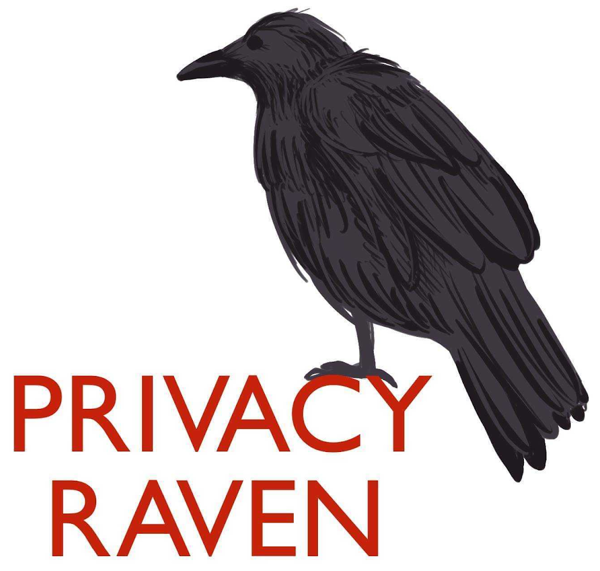

<p align="center">
 
</p>
<hr style="height:5px"/>

**PrivacyRaven** is a privacy testing library for deep learning systems.
You can use it to determine the susceptibility of a model to different privacy attacks; evaluate privacy preserving machine learning techniques; develop novel privacy metrics and attacks; and repurpose attacks for data provenance and other use cases.

PrivacyRaven supports label-only black-box model extraction, membership inference, and (soon) model inversion attacks.
We also plan to include differential privacy verification, automated hyperparameter optimization, more classes of attacks, and other features; see the [GitHub issues](https://github.com/trailofbits/PrivacyRaven/issues) for more information.
PrivacyRaven has been featured at the [OpenMined Privacy Conference](https://www.youtube.com/watch?v=F46lX5VIoas&list=PLUNOsx6Az_ZGKQd_p4StdZRFQkCBwnaY6&t=2h21m50s), [Empire Hacking](https://www.empirehacking.nyc/), and [Trail of Bits blog](https://blog.trailofbits.com/2020/10/08/privacyraven-has-left-the-nest/).

## Why use PrivacyRaven?

Deep learning systems, particularly neural networks, have proliferated in a wide range of applications, including privacy-sensitive use cases such as facial recognition and medical diagnoses.
However, these models are vulnerable to privacy attacks that target both the intellectual property of the model and the confidentiality of the training data.
Recent literature has seen an arms race between privacy attacks and defenses on various systems.
And until now, engineers and researchers have not had the privacy analysis tools they need to rival this trend.
Hence, we developed PrivacyRaven- a machine learning assurance tool that aims to be:
+ **Usable**: Multiple levels of abstraction allow users to either automate much of the internal mechanics or directly control them, depending on their use case and familiarity with the domain. 
+ **Flexible**: A modular design makes the attack configurations customizable and interoperable. It also allows new privacy metrics and attacks to be incorporated straightforwardly.
+ **Efficient**: PrivacyRaven reduces the boilerplate, affording quick prototyping and fast experimentation. Each attack can be launched in fewer than 15 lines of code.

## How does it work?

PrivacyRaven partitions each attack into multiple customizable and optimizable phases.
Different interfaces are also provided for each attack.
The interface shown below is known as the core interface.
PrivacyRaven also provides wrappers around specific attack configurations found in the literature and a run-all-attacks feature.

Here is how you would launch a model extraction attack in PrivacyRaven:

```python
#examples/extract_mnist.py
import privacyraven as pr
from privacyraven.utils.data import get_emnist_data
from privacyraven.extraction.core import ModelExtractionAttack
from privacyraven.utils.query import get_target
from privacyraven.models.victim import train_mnist_victim
from privacyraven.models.pytorch import ImagenetTransferLearning

# Create a query function for a PyTorch Lightning model
model = train_mnist_victim()

def query_mnist(input_data):
    return get_target(model, input_data)

# Obtain seed (or public) data to be used in extraction
emnist_train, emnist_test = get_emnist_data()

# Run a Model Extraction Attack

attack = ModelExtractionAttack(
    query_mnist, # query function
    100, # query limit
    (1, 28, 28, 1), # victim input shape
    10, # target classes
    (1, 3, 28, 28), # substitute input shape
    "copycat", # name of synthesizer
    ImagenetTransferLearning, # substitute model
    1000, # substitute input size
    emnist_train, # seed training data
    emnist_test # seed testing data
)
```
Since the only main requirement from the victim model is a query function, PrivacyRaven can be used to attack a wide range of models regardless of the framework and distribution method.
The other classes of attacks can be launched in a similar fashion. See the `examples` folder for more information.

## Want to use PrivacyRaven?

1. Install [poetry](https://python-poetry.org/docs/).
2. Git clone this repository.
3. Run `poetry install`.

Feel free to join our #privacyraven channel in [Empire Hacking](https://empireslacking.herokuapp.com/) if you need help using or extending PrivacyRaven.
The official pip release will arrive soon.

## Want to contribute to PrivacyRaven?

PrivacyRaven is still a work-in-progress.
We invite you to contribute however you can whether you want to incorporate a new synthesis technique or make an attack function more readable.
Please visit [CONTRIBUTING.md](https://github.com/trailofbits/PrivacyRaven/blob/master/CONTRIBUTING.md) to get started.

## Why is it called PrivacyRaven?

The raven has been associated with a variety of concepts in different cultures through time.
Among these, the raven is commonly associated with prophecy and insight.
Naturally, we named the tool PrivacyRaven because it is designed to provide insights into the privacy of deep learning.

## Who maintains PrivacyRaven?

The core maintainers are:
+ [Suha S. Hussain](https://github.com/suhacker1)
+ [Jim Miller](https://github.com/james-miller-93)

## License

This library is available under the [Apache License 2.0](https://github.com/trailofbits/PrivacyRaven/blob/master/LICENSE).
For an exception to the terms, please [contact us](mailto:opensource@trailofbits.com).

## References

While PrivacyRaven was built upon a [plethora of research](https://github.com/stratosphereips/awesome-ml-privacy-attacks) on attacking machine learning privacy, the research most critical to the development of PrivacyRaven are:

+ [A Survey of Privacy Attacks in Machine Learning](https://arxiv.org/abs/2007.07646)
+ [Label-Only Membership Inference Attacks](https://arxiv.org/abs/2007.143210)
+ [Neural Network Inversion in Adversarial Setting via Background Knowledge Alignment](https://dl.acm.org/doi/pdf/10.1145/3319535.3354261?casa_token=lDNQ40-4Wa4AAAAA%3Ap9olQ3qMdDZ0n2sl-nNIgk4sOuLRMBTGVTxycZ5wjGpnFPf5lTz-MYw0e8ISggSseHC9T46it5yX)
+ [Copycat CNN: Stealing Knowledge by Persuading Confession with Random Non-Labeled Data](https://ieeexplore.ieee.org/document/8489592)
+ [Knockoff Nets: Stealing Functionality of Black-Box Models](https://arxiv.org/abs/1812.02766)
